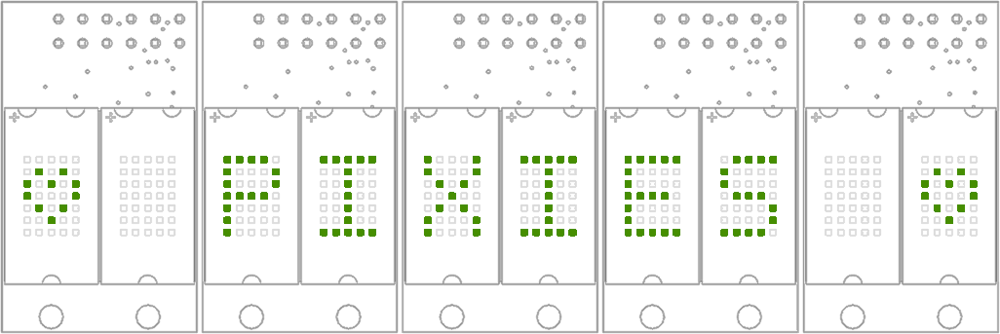

----------
# Pixie for Arduino 

https://www.tindie.com/products/connornishijima/pixie-chainable-dual-57-micro-led-displays/

**Pixies are chainable 5x7 microdot LED matrices great for showing... just about anything you can throw at them!**

- Dual 5x7 LED matrices
- 2.7V to 5.5V supply
- Fast bitmap control
- 7-bit global PWM (128 brightness levels)
- Over-temperature protection
- Resettable from controlling device
- Reprogrammable ATTINY45 microcontroller
- 5.1mm * 7.6mm matrix size (19.92 ppi)
- 20.6mm * 34.7mm package
- M2.5 mouting holes

*Pixies mounted into a home-made case!*

# New to Pixies?

Thank you for your order! Try our **[Getting Started Guide](https://github.com/connornishijima/Pixie/blob/master/getting_started.md)** to get them wired up!

## Included in this repository:

**[PIXIE WEBSITE](https://connornishijima.github.io/Pixie/) *(Contains all documentation and tools in one spot)***

- Arduino Library Source Code
- Software Documentation
- Hardware Datasheet
- Pixie Icon Generator
- Raspberry Pi Python Driver
- PCB Gerbers

## Software Documentation

Documentation for the Pixie library is available in both the /examples directory for Arduino, and at the site below:

**[Library Documentation & Usage](https://connornishijima.github.io/Pixie/extras/documentation.html)**

We also have a **[Getting Started Guide](https://github.com/connornishijima/Pixie/blob/master/getting_started.md)** to help you get set up for the very first time!

## Hardware Documentation

Pixie has a comprehensive hardware datasheet (including internal firmware documentation and package dimensions for mounting) available here:

**[PIXIE DATASHEET](https://connornishijima.github.io/Pixie/extras/datasheet.html)**

This library also contains a Pixie EAGLE library (In "extras/hardware") for adding Pixies into your own PCB layouts!

----------
# Arduino Library Installation

**With Arduino Library Manager:** ***(Stable - RECOMMENDED)***

1. Open *Sketch > Include Library > Manage Libraries* in the Arduino IDE.
2. Search for "Pixie" by Connor Nishijima, and select the latest version.
3. Click the Install button and Arduino will prepare the library and examples for you!

**Manual Install:** (Hourly Builds)

1. Click "Clone or Download" above to get an "Pixie-master.zip" file.
2. Extract its contents to the libraries folder in your Arduino sketchbook. ("C:/Users/**YOUR_USERNAME**/Documents/Arduino/libraries" on Windows)
3. Rename the folder from "Pixie-master" to "Pixie".

----------
# Build Status

Pixie for Arduino is automatically tested with Travis CI against: 
- ATmega328p (Uno)
- ATmega2560 (Mega)
- ATmega32u4 (Leonardo)
- ESP8266
- ESP32

*Currently untested are STM/Cortex or SAMD platforms such as the Teensy 3+ and Arduino MKR.*

Is it marked "Failing"? **No worries!** If you install Pixie using the Arduino Library Manager, you'll be getting the latest stable release. *This GitHub repo is under frequent changes, and some of these changes may be breaking at times.*

----------
# Contributing
Any advice or pull requests are welcome! *(This repository uses **snake_case**, not **camelCase**.)*

----------
# License and Credits
**Developed by Connor Nishijima (Copyright 2020)**

I work full-time as a Tindie seller providing income for my wife and I. You are free to make your own Pixies with the infomation provided in this repository, but **please be ethical and *do not sell clones***. If you modify any information from this repository, and have used it to make improvements to my hardware design that you truly think makes your version superior to the original (and thus could compete in sales due to these advantages) then - at the very least - **please attribute** Lixie Labs LLC if you sell them. (As required by the GPLv3 License below and included in the root of this repository.)

### Accepted Pull Requests:
- **ivankravets** - [Fix Broken JSON](https://github.com/connornishijima/Pixie/pull/1)

**Released under the [GPLv3 License](http://www.gnu.org/licenses/gpl-3.0.en.html).**
